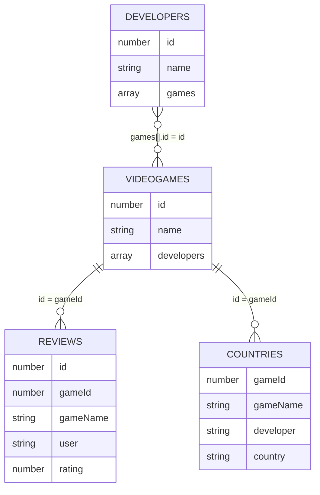

# Modelo de datos

La base de datos usa MongoDB y se organiza en cuatro colecciones: `videogames`, `developers`, `reviews` y `countries`.

El recurso principal es `videogames`. Las demás colecciones se relacionan con los videojuegos mediante identificadores repetidos, principalmente `gameId`. No se usan claves foráneas como en una base de datos relacional.

## Colecciones

| Colección | Recurso REST | Origen | Documentos en el dataset |
|---|---|---|---:|
| `videogames` | `/games` | RAWG API | 1000 |
| `developers` | `/developers` | RAWG API | 600 |
| `reviews` | `/reviews` | Datos propios generados | 3504 |
| `countries` | `/countries` | Wikidata Query Service | 806 |

Estos números corresponden a los archivos incluidos actualmente en `api/datasets/`. Si se regenera `reviews.json`, el total puede cambiar porque el script crea entre 2 y 5 reviews por videojuego.

## Relaciones

- `videogames.id` identifica cada videojuego.
- `reviews.gameId` apunta al videojuego al que pertenece la review.
- `countries.gameId` apunta al videojuego asociado a un desarrollador y país.
- `developers.games[].id` contiene los videojuegos relacionados con cada desarrollador.



## `videogames`

Colección principal del proyecto. Contiene 1000 videojuegos importados desde RAWG y es la colección usada para cumplir el requisito de volumen mínimo. Se consulta desde `/games`.

| Campo | Tipo | Descripción |
|---|---|---|
| `id` | Number | Identificador público del videojuego. Viene de RAWG y se usa en las rutas. |
| `slug` | String | Nombre simplificado del videojuego. |
| `name` | String | Nombre del videojuego. |
| `released` | String/null | Fecha de lanzamiento. |
| `background_image` | String/null | URL de imagen del videojuego. |
| `rating` | Number/null | Valoración media entre 0 y 5. |
| `metacritic` | Number/null | Puntuación de Metacritic entre 0 y 100. |
| `playtime` | Number/null | Tiempo medio de juego. |
| `platforms` | Array<String> | Plataformas disponibles. |
| `genres` | Array<String> | Géneros del videojuego. |
| `stores` | Array<String> | Tiendas donde aparece el videojuego. |
| `esrb_rating` | String/null | Clasificación por edades. |
| `developers` | Array<String> | Desarrolladores asociados. Es opcional y se usa en videojuegos creados o actualizados desde la API si se envía este campo. |

Ejemplo:

```json
{
  "id": 3498,
  "slug": "grand-theft-auto-v",
  "name": "Grand Theft Auto V",
  "released": "2013-09-17",
  "background_image": "https://media.rawg.io/media/games/20a/20aa03a10cda45239fe22d035c0ebe64.jpg",
  "rating": 4.47,
  "metacritic": 92,
  "playtime": 74,
  "platforms": ["PlayStation 5", "Xbox Series S/X", "PlayStation 3", "PC", "PlayStation 4", "Xbox 360", "Xbox One"],
  "genres": ["Action"],
  "stores": ["Steam", "PlayStation Store", "Epic Games", "Xbox 360 Store", "Xbox Store"],
  "esrb_rating": "Mature",
  "developers": ["Rockstar North"]
}
```

Rutas principales:

- `GET /games`
- `GET /games/:id`
- `GET /games/:id/reviews`
- `GET /games/:id/country`
- `GET /games/:id/enriched`
- `POST /games`
- `PUT /games/:id`
- `DELETE /games/:id`

`GET /games` permite búsquedas, filtros, ordenación y paginación mediante query params como `search`, `platform`, `genre`, `store`, `minRating`, `page`, `limit` y `sort`.

## `developers`

Colección de desarrolladores importados desde RAWG. Cada documento incluye una lista de juegos relacionados en el campo `games`.

| Campo | Tipo | Descripción |
|---|---|---|
| `id` | Number | Identificador público del desarrollador. Viene de RAWG. |
| `name` | String | Nombre del desarrollador. |
| `slug` | String | Nombre simplificado. |
| `games_count` | Number | Número de juegos asociados en RAWG. |
| `image_background` | String/null | Imagen asociada al desarrollador. |
| `games` | Array<Object> | Juegos relacionados con el desarrollador. |

Ejemplo:

```json
{
  "id": 1612,
  "name": "Valve Software",
  "slug": "valve-software",
  "games_count": 44,
  "image_background": "https://media.rawg.io/media/games/46d/46d98e6910fbc0706e2948a7cc9b10c5.jpg",
  "games": [
    {
      "id": 4200,
      "slug": "portal-2",
      "name": "Portal 2",
      "added": 20858
    }
  ]
}
```

Rutas principales:

- `GET /developers`
- `GET /developers/:id`
- `POST /developers`
- `PUT /developers/:id`
- `DELETE /developers/:id`

`GET /developers` permite buscar por nombre o slug, filtrar por `gameId`, paginar y ordenar.

## `reviews`

Colección de reviews generadas para el proyecto. Sirve como recurso propio sobre el que se pueden hacer altas, modificaciones y borrados sin depender directamente de RAWG.

| Campo | Tipo | Descripción |
|---|---|---|
| `id` | Number | Identificador de la review. |
| `gameId` | Number | ID del videojuego al que pertenece. |
| `gameName` | String | Nombre del videojuego. Se guarda para que la respuesta sea más clara. |
| `user` | String | Usuario que escribe la review. |
| `rating` | Number | Valoración entre 1 y 5. |
| `comment` | String | Texto de la review. |
| `createdAt` | String/Date | Fecha de creación. |

Ejemplo:

```json
{
  "id": 1,
  "gameId": 3498,
  "gameName": "Grand Theft Auto V",
  "user": "darkmage",
  "rating": 3,
  "comment": "Buen juego para pasar el rato.",
  "createdAt": "2024-08-05T05:46:51.661Z"
}
```

Rutas principales:

- `GET /reviews`
- `GET /reviews/game/:gameId`
- `POST /reviews`
- `PATCH /reviews/:id`
- `DELETE /reviews/:id`
- `GET /games/:id/reviews`

## `countries`

Colección que relaciona videojuegos, desarrolladores y países. Los datos proceden de Wikidata y se guardan también como dataset XML en `api/datasets/countries.xml`.

No es una ficha completa de países. Para este proyecto solo se guarda el país asociado al desarrollador de un videojuego.

| Campo | Tipo | Descripción |
|---|---|---|
| `gameId` | Number | ID del videojuego relacionado. |
| `gameName` | String | Nombre del videojuego. |
| `developer` | String | Desarrollador asociado. |
| `country` | String | País asociado al desarrollador. |

Ejemplo en XML:

```xml
<country>
  <gameId>3498</gameId>
  <gameName>Grand Theft Auto V</gameName>
  <developer>Rockstar North</developer>
  <country>United Kingdom</country>
</country>
```

Esta información se devuelve en XML desde:

- `GET /countries`
- `GET /games/:id/country`

El XML tiene un schema asociado en `docs/countries.xsd`.

## Carga de datos

Los datos se cargan con scripts npm desde la carpeta `api`.

| Comando | Qué carga |
|---|---|
| `npm run seed:games` | `api/datasets/videogames.json` |
| `npm run seed:developers` | `api/datasets/developers.json` |
| `npm run seed:countries` | `api/datasets/countries.xml` |
| `npm run seed:reviews` | `api/datasets/reviews.json` |
| `npm run seed` | Ejecuta toda la carga en orden |

Los datasets están incluidos para que la API pueda seguir funcionando aunque RAWG o Wikidata no estén disponibles.

## Decisiones de diseño

- Se usa `id` como identificador público porque viene de RAWG y es más cómodo para las rutas que el `_id` interno de MongoDB.
- No se devuelve `_id` en las respuestas de la API.
- `gameId` conecta `reviews` y `countries` con `videogames`.
- `developers.games[]` mantiene los juegos relacionados porque RAWG ya entrega esa información así y MongoDB trabaja bien con arrays.
- `countries` es un recurso de consulta en XML. Los recursos modificables son `videogames`, `developers` y `reviews`.
- `gameName` se repite en `reviews` y `countries` para que las respuestas sean legibles sin hacer consultas adicionales.

## Restricciones de integridad

- `developers.games[].id` debe apuntar a un videojuego existente y `developers.games[].name` debe coincidir con el nombre guardado en `videogames`.
- `reviews.gameId` debe apuntar a un videojuego existente y `reviews.gameName` debe coincidir con el nombre guardado en `videogames`.
- No se permite cambiar el nombre ni eliminar un videojuego si tiene reviews, países o desarrolladores relacionados.
