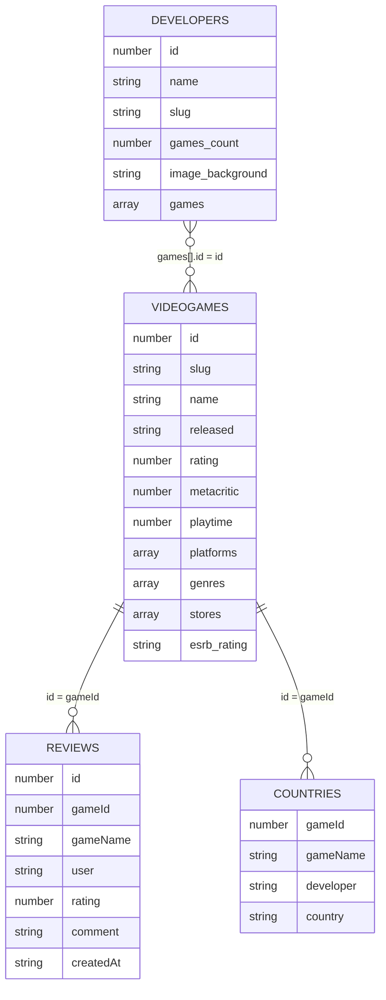

# Modelo de datos de la base de datos

La base de datos del proyecto está montada en MongoDB y se divide en cuatro colecciones: videojuegos, desarrolladores, reviews y países. El recurso principal es `videogames`, porque las reviews, los países y parte de la información de desarrolladores se entienden a partir de un videojuego concreto.

No se han usado claves foráneas como en una base de datos relacional. En su lugar, se repiten algunos identificadores para poder relacionar los documentos desde las rutas de la API. El más importante es `gameId`, que conecta reviews y países con `videogames.id`.

## Colecciones principales

| Colección | Recurso REST | Origen de los datos | Nº documentos |
|---|---|---|---:|
| `videogames` | `/games` | RAWG API | 1000 |
| `developers` | `/developers` | RAWG API | 600 |
| `reviews` | `/reviews` | Datos propios generados | 3482 |
| `countries` | `/countries` | Wikidata Query Service | 1612 |

## Relación entre recursos

El modelo queda organizado alrededor de los videojuegos:

- `videogames.id` identifica cada videojuego.
- `reviews.gameId` guarda el ID del videojuego al que pertenece la review.
- `countries.gameId` guarda el ID del videojuego asociado a un desarrollador y país.
- `developers.games[].id` contiene los juegos relacionados con cada desarrollador.



## `videogames`

Esta es la colección principal. Contiene los videojuegos obtenidos desde RAWG y es la colección que cumple el requisito de tener al menos 1000 documentos.

Campos principales:

| Campo | Tipo | Descripción |
|---|---|---|
| `id` | Number | Identificador del videojuego en RAWG. Es el ID que se usa en las rutas. |
| `slug` | String | Nombre simplificado del videojuego. |
| `name` | String | Nombre del videojuego. |
| `released` | String | Fecha de lanzamiento. |
| `background_image` | String | Imagen asociada al videojuego. |
| `rating` | Number | Valoración media. |
| `metacritic` | Number | Puntuación de Metacritic, si existe. |
| `playtime` | Number | Tiempo medio de juego. |
| `platforms` | Array | Plataformas disponibles. |
| `genres` | Array | Géneros del videojuego. |
| `stores` | Array | Tiendas donde aparece el videojuego. |
| `esrb_rating` | String/null | Clasificación por edades. |

Ejemplo:

```json
{
  "id": 3498,
  "slug": "grand-theft-auto-v",
  "name": "Grand Theft Auto V",
  "released": "2013-09-17",
  "rating": 4.47,
  "metacritic": 92,
  "playtime": 74,
  "platforms": ["PlayStation 5", "Xbox Series S/X", "PC", "PlayStation 4", "Xbox One"],
  "genres": ["Action"],
  "stores": ["Steam", "PlayStation Store", "Epic Games", "Xbox Store"],
  "esrb_rating": "Mature"
}
```

Algunas rutas que usan esta colección son:

- `GET /games`
- `GET /games/:id`
- `GET /games?search=witcher`
- `GET /games?platform=pc`
- `GET /games?page=2&limit=20`

## `developers`

Esta colección guarda los desarrolladores obtenidos desde RAWG. Cada documento incluye una lista de juegos relacionados dentro del propio desarrollador. Se dejó así porque RAWG ya devuelve la información de esa forma y en MongoDB resulta cómodo trabajar con arrays dentro del documento.

Campos principales:

| Campo | Tipo | Descripción |
|---|---|---|
| `id` | Number | Identificador del desarrollador en RAWG. |
| `name` | String | Nombre del desarrollador. |
| `slug` | String | Nombre simplificado. |
| `games_count` | Number | Número de juegos asociados en RAWG. |
| `image_background` | String | Imagen asociada. |
| `games` | Array | Juegos relacionados con el desarrollador. |

Ejemplo:

```json
{
  "id": 1612,
  "name": "Valve Software",
  "slug": "valve-software",
  "games_count": 44,
  "games": [
    {
      "id": 4200,
      "slug": "portal-2",
      "name": "Portal 2",
      "added": 20858
    },
    {
      "id": 4291,
      "slug": "counter-strike-global-offensive",
      "name": "Counter-Strike: Global Offensive",
      "added": 18350
    }
  ]
}
```

Desde la API se puede consultar el listado de desarrolladores, buscar por nombre o filtrar por un videojuego concreto usando `gameId`. Además, este recurso permite operaciones CRUD para añadir desarrolladores propios, corregir datos importados desde RAWG o eliminar registros que no se quieran mantener en la base de datos.

Rutas principales:

- `GET /developers`
- `GET /developers/:id`
- `POST /developers`
- `PUT /developers/:id`
- `DELETE /developers/:id`

## `reviews`

Las reviews son datos propios del proyecto. Se añadieron para tener un recurso que no dependa directamente de una API externa y sobre el que tenga sentido hacer altas, modificaciones y borrados.

Cada review se asocia a un videojuego mediante `gameId`. También se guarda `gameName`, aunque sea un dato repetido, porque hace las respuestas más fáciles de leer y permite entender el dataset sin consultar siempre `videogames`.

Campos principales:

| Campo | Tipo | Descripción |
|---|---|---|
| `id` | Number | Identificador de la review. |
| `gameId` | Number | ID del videojuego al que pertenece la review. |
| `gameName` | String | Nombre del videojuego. |
| `user` | String | Usuario que escribe la review. |
| `rating` | Number | Valoración entre 1 y 5. |
| `comment` | String | Comentario de la review. |
| `createdAt` | String/Date | Fecha de creación. |

Ejemplo:

```json
{
  "id": 1,
  "gameId": 3498,
  "gameName": "Grand Theft Auto V",
  "user": "darkmage",
  "rating": 3,
  "comment": "Se hace un poco repetitivo, pero entretiene.",
  "createdAt": "2025-03-21T00:50:07.631Z"
}
```

Esta colección se usa en `GET /reviews`, `POST /reviews`, `PATCH /reviews/:id` y `DELETE /reviews/:id`. También se puede acceder a las reviews de un juego desde `GET /games/:id/reviews`.

## `countries`

Esta colección guarda la relación entre videojuegos, desarrolladores y países. Los datos vienen de Wikidata, se conservan como XML en el dataset y después se cargan en MongoDB con el seed correspondiente.

No se guarda una ficha completa de cada país. Para este proyecto solo interesa saber qué desarrollador aparece asociado a un videojuego y a qué país pertenece.

Campos principales:

| Campo | Tipo | Descripción |
|---|---|---|
| `gameId` | Number | ID del videojuego relacionado. |
| `gameName` | String | Nombre del videojuego. |
| `developer` | String | Desarrollador asociado. |
| `country` | String | País asociado al desarrollador. |

Ejemplo en XML:

```xml
<country>
  <gameId>3328</gameId>
  <gameName>The Witcher 3: Wild Hunt</gameName>
  <developer>CD Projekt RED</developer>
  <country>Poland</country>
</country>
```

Esta información se devuelve en XML desde `GET /countries` y `GET /games/:id/country`. La estructura se valida con el schema `docs/countries.xsd`. El dataset actual contiene 1612 entradas `country`.

## Carga de datos

Los datos se cargan con scripts npm, por lo que no hace falta insertar documentos a mano para preparar la base de datos.

| Comando | Qué carga |
|---|---|
| `npm run seed:games` | Videojuegos desde `api/datasets/videogames.json` |
| `npm run seed:developers` | Desarrolladores desde `api/datasets/developers.json` |
| `npm run seed:countries` | Países desde `api/datasets/countries.xml` |
| `npm run seed:reviews` | Reviews generadas en `api/datasets/reviews.json` |
| `npm run seed` | Ejecuta toda la carga en orden |

Los datasets están incluidos en el repositorio para que la API pueda funcionar aunque RAWG o Wikidata no estén disponibles en ese momento.

## Decisiones de diseño

- Se usa `id` como identificador funcional porque viene de RAWG y es más cómodo para las rutas REST que el `_id` interno de MongoDB.
- Se mantiene `gameId` en `reviews` y `countries` para relacionar esas colecciones con `videogames`.
- En `developers`, la lista de juegos se deja dentro del documento porque RAWG ya devuelve los datos así y MongoDB permite trabajar bien con arrays.
- `countries` se deja como recurso de consulta en XML porque representa información importada desde Wikidata. Los recursos modificables de la API son `videogames`, `developers` y `reviews`.
- Se repite `gameName` en algunas colecciones para que las respuestas sean más claras.
- El XML de países se conserva como dataset porque el proyecto pide trabajar también con mensajes XML y tener un schema asociado.
